# Network Traffic Analysis

Investigation of suspicious network activity. Multiple HTTP requests, malware download, and malicious DNS activity were identified via Wireshark and confirmed through OSINT. Activity is linked to Pikabot malware infrastructure.

### Top Talkers

- Three IPs generated the most traffic (~1 MB):

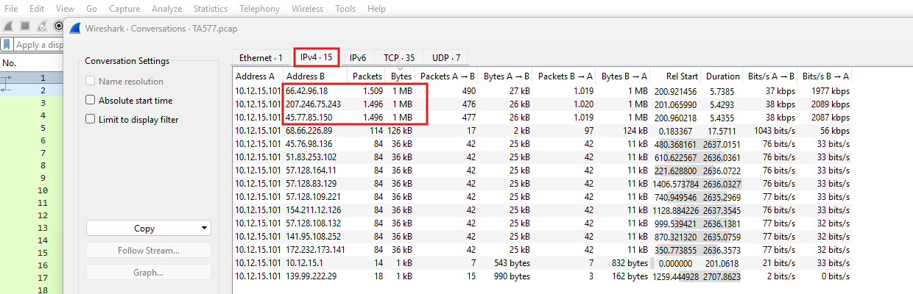

### Initial HTTP Activity

- First HTTP request observed at 16:01 UTC (packet 6).

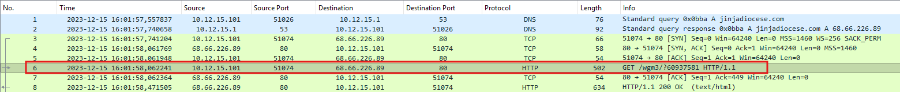

- First HTTP request at 16:01 UTC (packet 6)
- HTTP stream shows communication with:
  - Domain: jinjadiocese[.]com
  - IP: 68.66.226.89

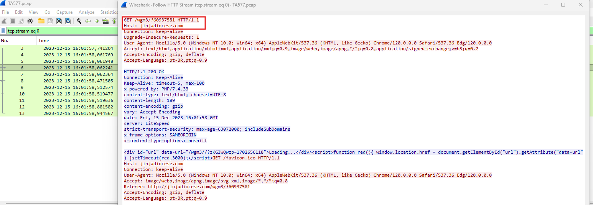

### OSINT - Domain & IP

- 68.66.226.89
  - AbuseIPDB flagged
  - VirusTotal detections

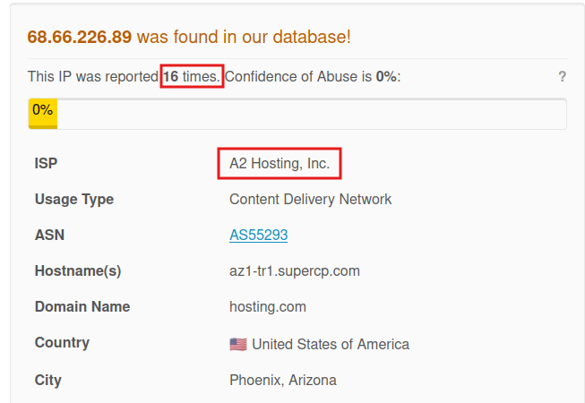

- jinjadiocese[.]com
  - Whois: created 2025-01-19, updated 2025-01-19
  - VirusTotal: 2 detections
  - Linked to suspicious activity in OTX

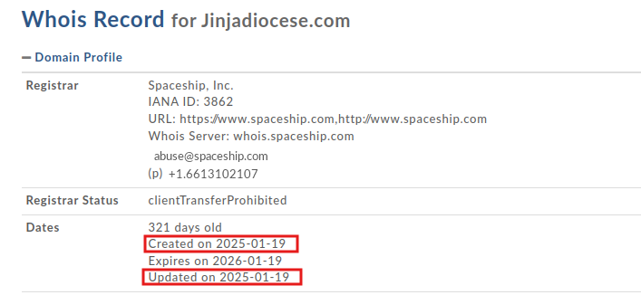

### Suspicious File Download

- Packet 17 shows second GET request.
- File delivered: `GURVU.zip`
- MIME type: application/octet-stream (malware payload)

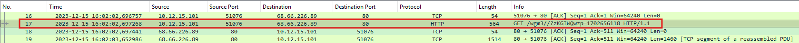
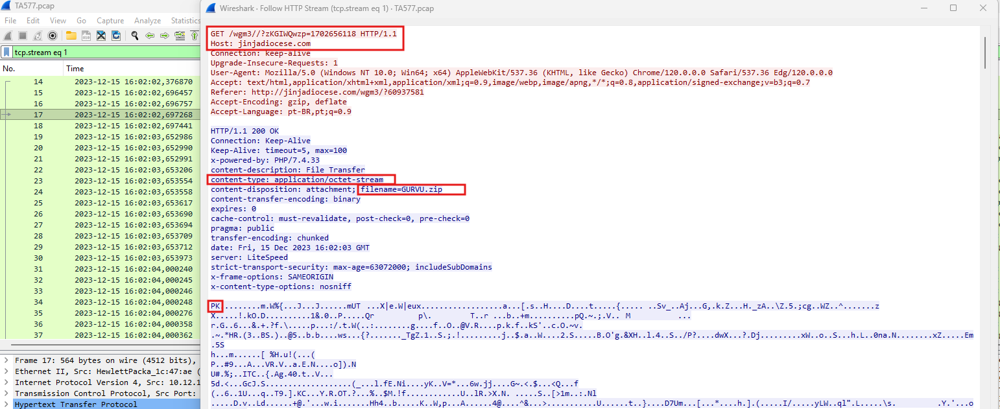

- This is typical for malware payload delivery.

### DNS Activity

- Packet 117: multiple `.dat` domains queried
- Responses: no records -> possible C2 instructions

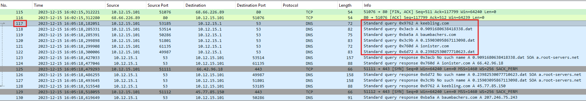
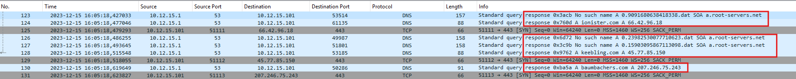

### Additional domains resolved (Pikabot)

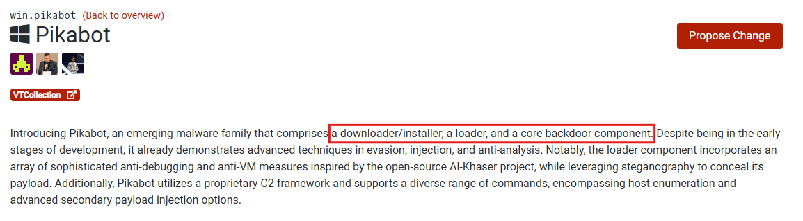

### Malware File Analysis

- Exported `GURVU.zip` via:
  - `File -> Export Objects -> HTTP -> packet 111`

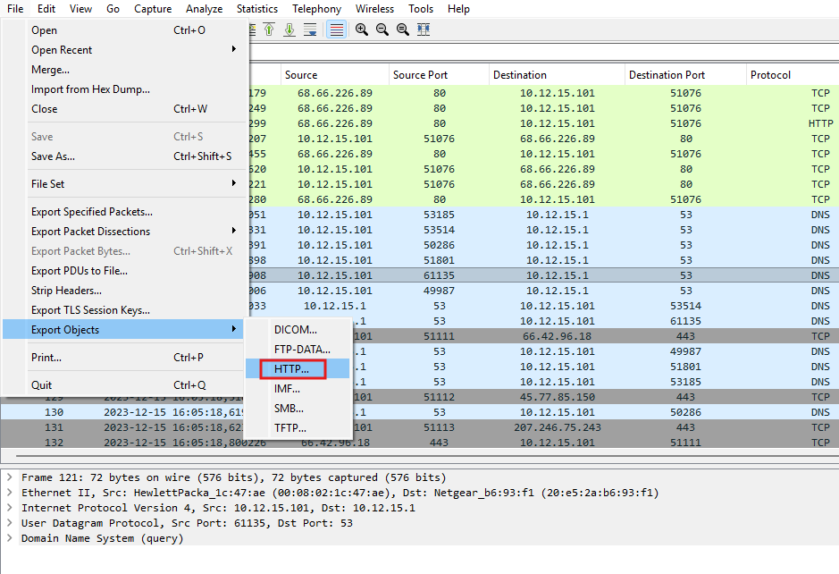
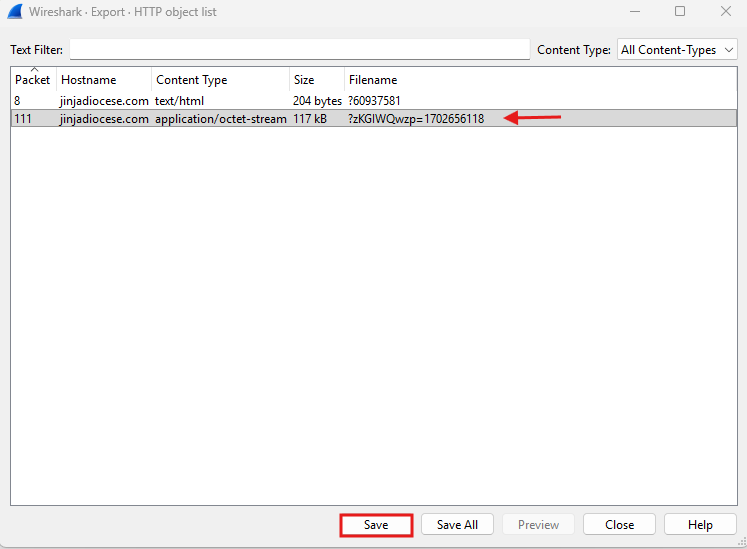

### SHA256 Hash

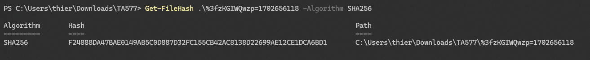

### VirusTotal Result

- 28 vendors flagged the file as malicious

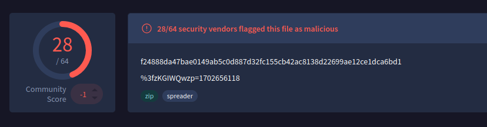

---

### Conclusion

- Activity confirmed as malicious Pikabot infrastructure
- HTTP download, DNS C2 queries, and malware hash confirm compromise potential
- Recommended SOC actions: block IPs/domains, isolate file, update IDS signatures, monitor DNS

---

### Useful Resources

- [AbuseIPDB](https://www.abuseipdb.com/)
- [VirusTotal](https://www.virustotal.com/gui/home/upload)
- [DomainTools](https://whois.domaintools.com/)
- [AlienVault OTX](https://otx.alienvault.com/browse/global/pulses?sort=-modified&page=1&include_inactive=0&limit=10)
- [Wireshark](https://2.na.dl.wireshark.org/win64/Wireshark-4.2.3-x64.exe)
