# IDS deployment & rules | Network Security, Detection

This project focuses on detecting and analyzing malicious network traffic using Suricata and Zeek.
The goal is to validate suspicious activity observed in a PCAP file and confirm malware behavior through IDS alerts, network logs, file extraction, and OSINT.

## Suricata Detection

Suricata was used to analyze the PCAP file in offline mode.

```sh
sudo suricata -r Zeek_Suricata.pcap
```

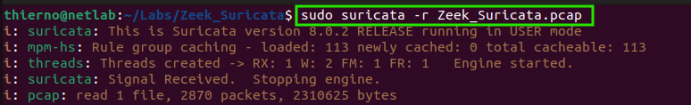

Suricata generated multiple alerts. The `fast.log` file was parsed to identify the most frequent alert types.

```sh
cat fast.log | cut -d '}' -f 2 | cut -d ':' -f 1 | cut -d ' ' -f 2 | sort | uniq -c | sort -nr
```

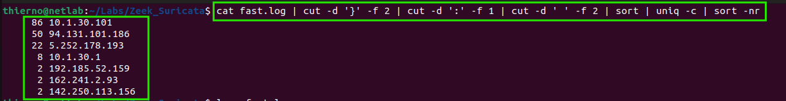

This confirms that the traffic was detected as suspicious by IDS signatures.

## Zeek Traffic Analysis

Zeek was used to extract network metadata and build a clear activity timeline.

```sh
sudo /opt/zeek/bin/zeek -r Zeek_Suricata.pcap
ls
```

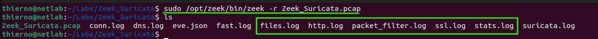

### Connection Analysis

```sh
cat conn.log | zeek-cut ts id.orig_h id.resp_h id.resp_p service
```

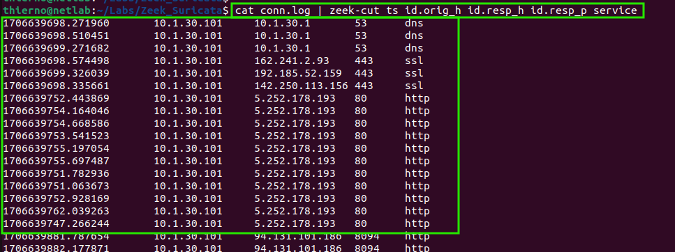

This shows repeated outbound connections to external hosts over HTTP, indicating possible command-and-control communication.

### DNS Analysis

DNS traffic was reviewed to identify suspicious domain activity.

```sh
cat dns.log | less
```


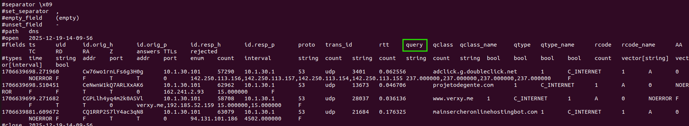

Filtered DNS queries:

```sh
cat dns.log | zeek-cut ts id.orig_h query
```

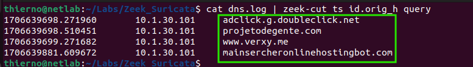

Several suspicious and newly registered domains were observed, consistent with malware C2 behavior.

## OSINT Validation

The identified domains and IPs were checked using **VirusTotal** and **Whois. Domaintools**.

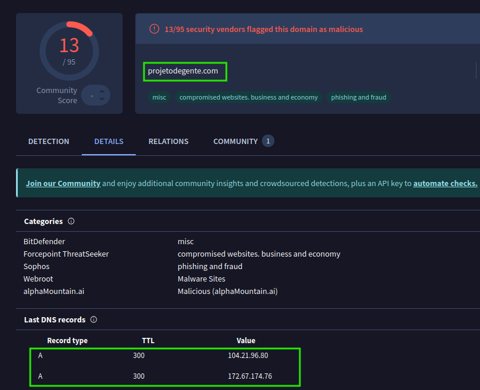
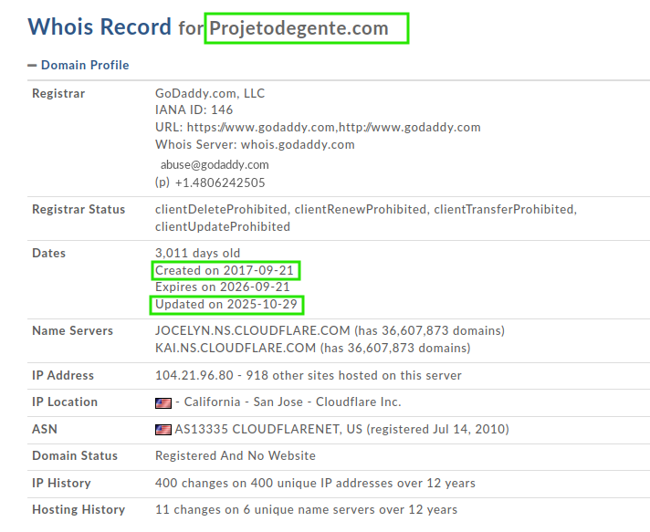
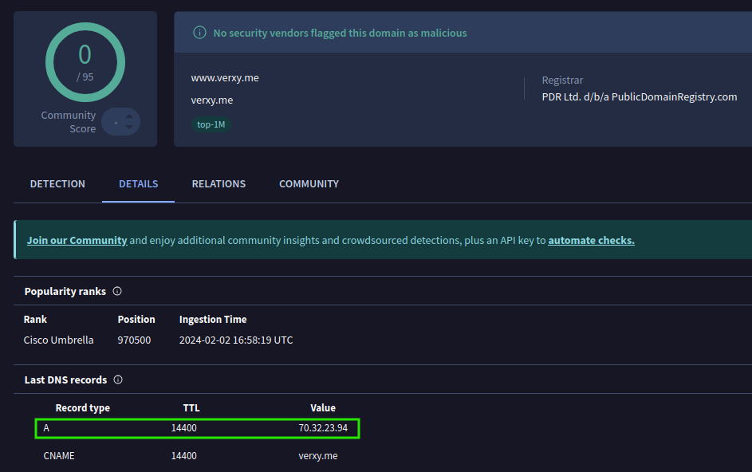
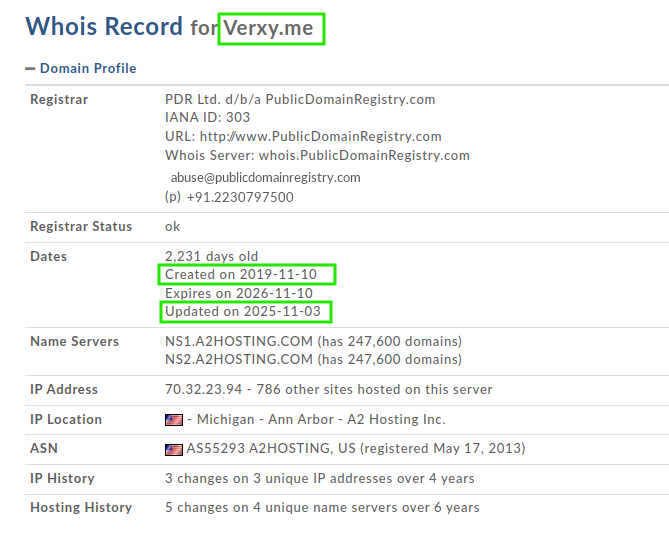
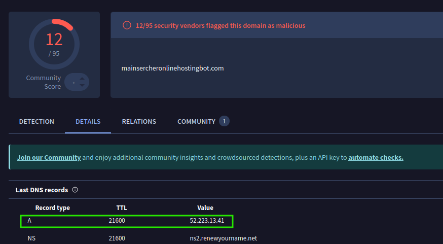

Results confirmed links to malicious infrastructure associated with Pikabot.

## HTTP Activity Analysis

```sh
cat http.log | zeek-cut ts id.orig_h id.resp_h method uri user_agent
```

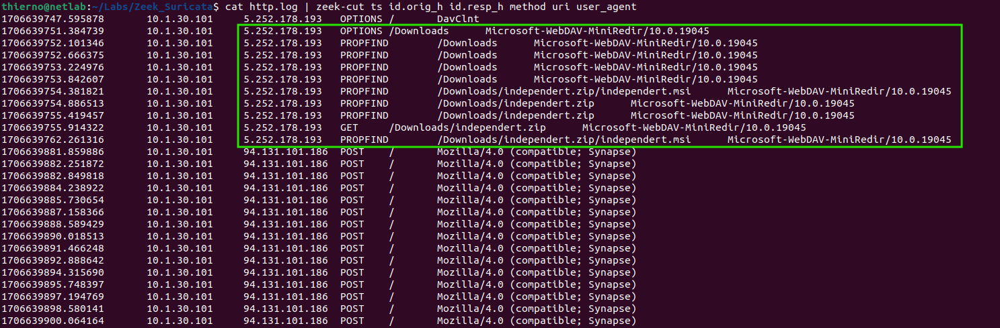

HTTP GET requests were observed, showing file downloads from suspicious external servers.

## File Extraction and Analysis

```sh
cat files.log | zeek-cut ts id.orig_h id.resp_h mime_type filename
```

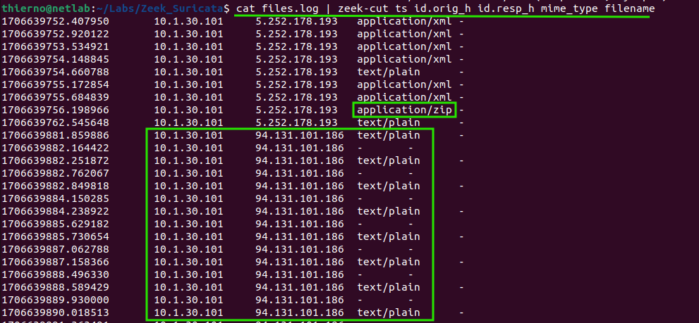

The downloaded files were identified as binary payloads.

VirusTotal analysis confirmed malicious behavior.

## Virustotal

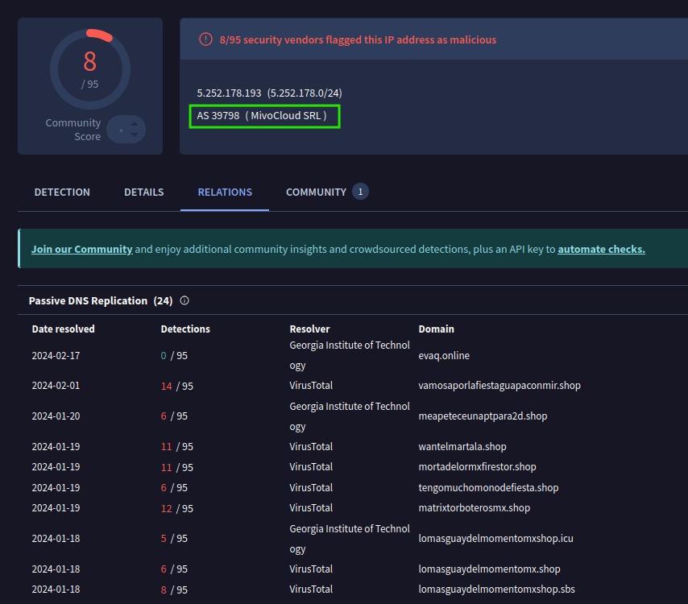
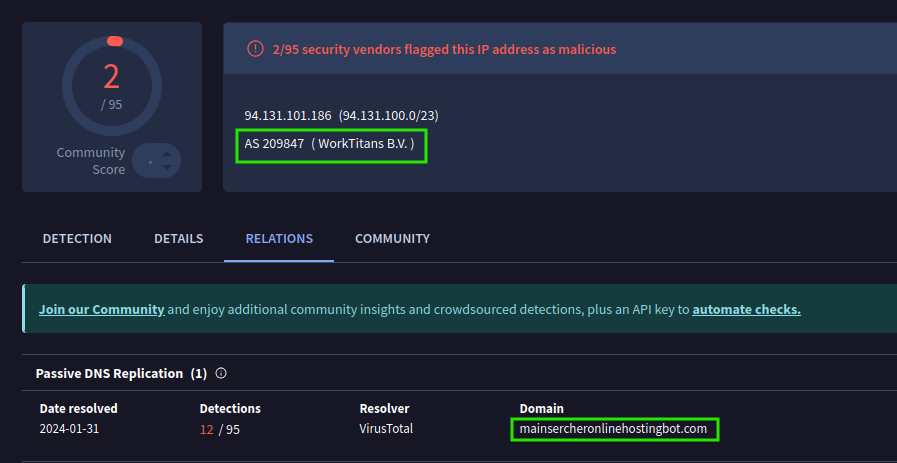

File inspection:

```sh
files *
```

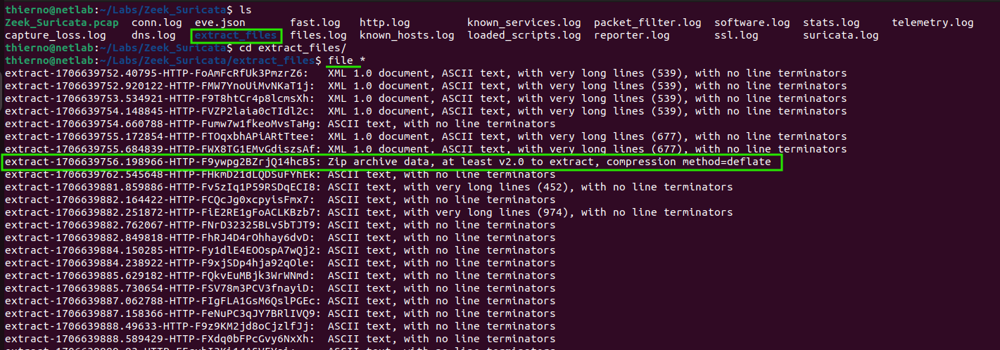

Extracted files were organized and unpacked.

```sh
mv extract-* zip/
```

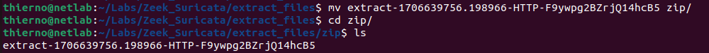

```sh
unzip extract-*
sha256sum independert.msi
```

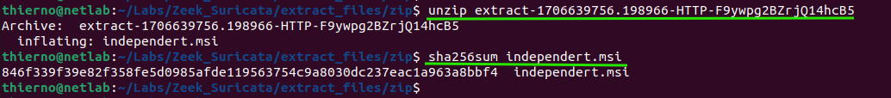
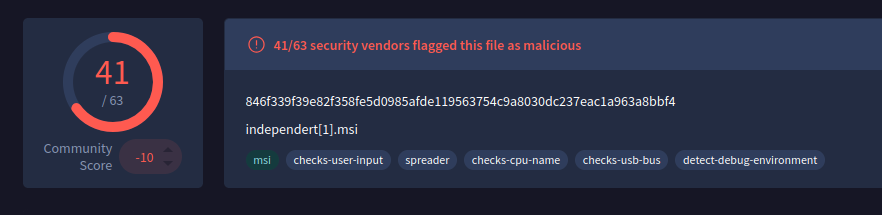

The SHA256 hash was flagged as malicious by multiple security vendors.

## Conclusion

This analysis confirms malicious network activity linked to Pikabot malware.
Suricata detected the threat, Zeek provided detailed network visibility, and OSINT validated the malware infrastructure and payload.

- **Key takeaways:**

  - IDS alerts confirmed suspicious traffic

  - DNS and HTTP behavior matched C2 patterns

  - Malware payload was successfully extracted and verified

---

### Useful Resources

- [AbuseIPDB](https://www.abuseipdb.com/)
- [VirusTotal](https://www.virustotal.com/gui/home/upload)
- [DomainTools](https://whois.domaintools.com/)
- [AlienVault OTX](https://otx.alienvault.com/browse/global/pulses?sort=-modified&page=1&include_inactive=0&limit=10)
- [Wireshark](https://2.na.dl.wireshark.org/win64/Wireshark-4.2.3-x64.exe)
