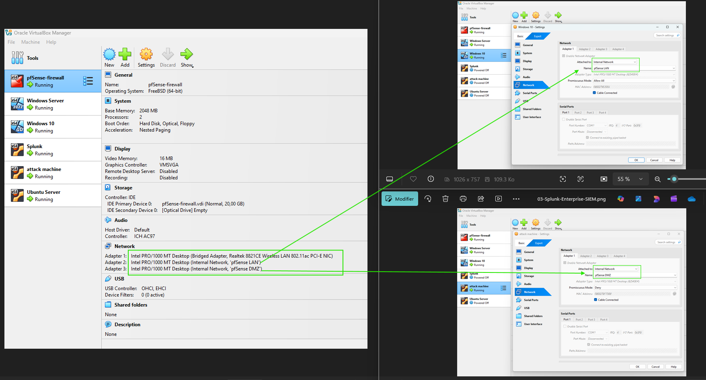
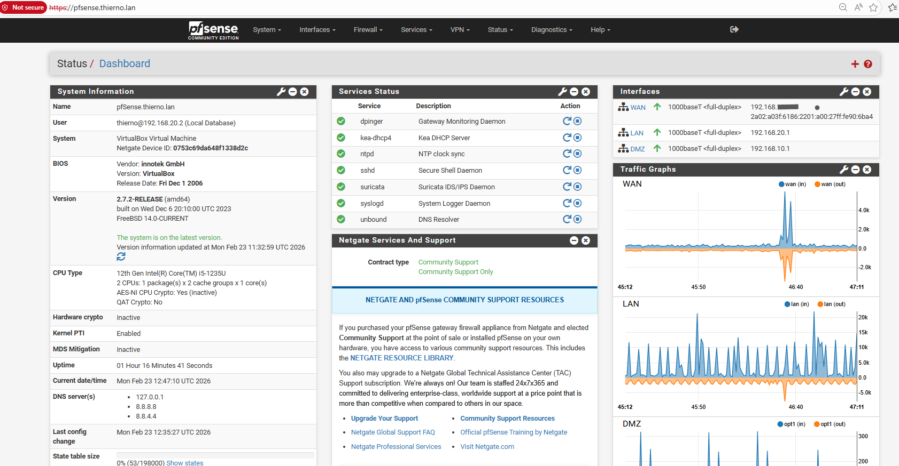
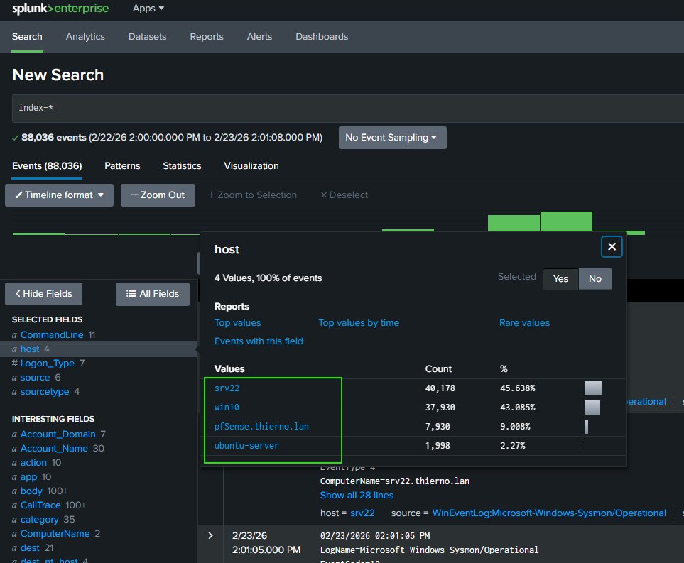

# ENTERPRISE SOC MONITORING & THREAT DETECTION PLATFORM

This project simulates a real-world enterprise SOC environment with centralized monitoring, multi-source detection, risk-based correlation, and automated containment workflows.

## PROJECT OVERVIEW

- **Role**: SOC Analyst
- **Duration**: 3 Months
- **Environment**: Hybrid Enterprise Network (Windows & Linux)
- **Architecture Type**: Segmented LAN/DMZ with centralized SIEM
- **Objective**: Design and implement a detection-driven SOC with automated containment and risk-based prioritization.

### Security Goals

- Reduce dwell time
- Improve detection coverage
- Enable automated containment
- Reduce false positives

---

## TECHNOLOGY STACK

- **Splunk Enterprise** - Log aggregation, correlation, dashboards, risk engine
- **Suricata** - Network IDS/IPS monitoring
- **pfSense** - Firewall + automated blocking
- **Sysmon** - Advanced Windows telemetry
- **auditd** - Linux process and command auditing

---

## NETWORK ARCHITECTURE

- **Core Systems**

| System         | IP           | Role                      |
| -------------- | ------------ | ------------------------- |
| Windows Server | 192.168.20.2 | Active Directory + Sysmon |
| Windows 10     | 192.168.20.3 | Domain Client             |
| Ubuntu Server  | 192.168.20.4 | SSH + auditd              |
| Splunk SIEM    | 192.168.20.5 | Log correlation           |
| Kali Linux     | 192.168.10.5 | Controlled attacker       |

- Network segmentation ensures realistic enterprise security boundaries.

---

## DATA SOURCES INGESTED

| Source         | Log Type          | Key Events                          |
| -------------- | ----------------- | ----------------------------------- |
| Windows Server | Security + Sysmon | 4624, 4625, 4662, 4769, 4698, 1, 10 |
| Windows 10     | Security + Sysmon | Logon, Process creation             |
| Ubuntu         | auth.log + auditd | SSH authentication, EXECVE          |
| pfSense        | Firewall logs     | Network traffic                     |
| Suricata       | IDS Alerts        | Scans, C2, anomalies                |

- Detection methodology combines signature-based detection, behavior analysis, and risk-based correlation.

---

## DETECTION STRATEGY

- The detection strategy follows a layered defense approach combining endpoint telemetry, network monitoring, and risk-based correlation to enable proactive threat detection and response.
- All detection logic is mapped to the MITRE ATT&CK framework to ensure structured coverage of adversary tactics and techniques.

---

## DETECTION USE CASES

### RDP BRUTE FORCE (MITRE T1110)

- **Detection Logic:**
  - Monitor excessive Windows Event ID 4625 (failed logons).

  
  
  
  

---

## ENCODED POWERSHELL (MITRE T1059)

- **Detection Logic:**
  - Detect suspicious PowerShell execution via Sysmon Event ID 1.

  

---

## LSASS CREDENTIAL DUMPING (MITRE T1003)

- **Detection Logic:**
  - Monitor Sysmon Event ID 10 for access to lsass.exe.

  

---

## KERBEROASTING (MITRE T1558.003)

---

## DCSYNC (MITRE T1003.006)

---

## SSH BRUTE FORCE (MITRE T1110)

---

## REVERSE SHELL (MITRE T1059)

---

## PORT SCAN (MITRE T1046)

---

## PERSISTENCE (Scheduled Task, MITRE T1053)

---

## GLOBAL RISK ENGINE

- Risk-based correlation engine aggregating multiple signals.

---

## AUTOMATED RESPONSE WORKFLOW

- When risk score > 200:
  - Identify malicious IP
  - Trigger firewall block via SSH
  - Verify rule insertion
  - Create incident ticket
  - Launch forensic process

- Firewall command: `"easyrule block DMZ <IP>"`

  
  

---

## SKILLS DEMONSTRATED

- SIEM engineering with Splunk Enterprise
- Multi-source log correlation (Windows, Linux, Network)
- MITRE ATT&CK technique mapping
- Detection rule development & tuning
- Risk-based alert prioritization
- Automated containment via pfSense
- Incident response workflow design

## CONCLUSION

- Designed and implemented an integrated risk engine enabling proactive threat containment instead of reactive monitoring.
- Demonstrated scalable security monitoring architecture applicable to medium and large enterprise environments.
