# SOC Monitoring & Threat Detection Platform

## Implementation & Detection Engineering Report

- **Author**: Thierno Barry
- **Date**: 27 February 2026
- **Duration**: 3 Months
- **Role**: SOC Analyst / Junior Detection Engineer
- **Environment**: Windows, Linux, pfSense, Kali Linux
- **SIEM Platform**: Splunk Enterprise

---

## 1. Project Overview

This project is the design and implementation of a complete Security Operations Center (SOC) lab.

- The objective was to:
  - Detect common cyber attacks
  - Monitor Windows and Linux systems
  - Use risk-based alerting
  - Automate incident response
  - Reduce false positives

All detections were mapped to the MITRE ATT&CK framework to ensure structured coverage of attacker techniques.

---

## 2. Network Architecture

### 2.1 Systems

| System         | IP Address   | Role                         |
| -------------- | ------------ | ---------------------------- |
| Windows Server | 192.168.20.2 | Active Directory + Sysmon    |
| Windows 10     | 192.168.20.3 | User workstation             |
| Ubuntu Server  | 192.168.20.4 | Linux server + auditd        |
| Splunk SIEM    | 192.168.20.5 | Log collection & correlation |
| Kali Linux     | 192.168.10.5 | Kali Linux attack machine    |
| Firewall       | -            | pfSense                      |
| IDS            | -            | Suricata                     |

---

### 2.2 Network Segmentation

- LAN: 192.168.20.0/24
- DMZ: 192.168.10.0/24

Kali Linux is placed in the DMZ to simulate external attacks.

Network segmentation improves security and limits lateral movement.

---

## 3. Data Sources

- Logs are collected and sent to Splunk Enterprise from:
  - Windows Security Logs
  - Sysmon logs
  - Linux auth.log
  - auditd
  - pfSense firewall logs
  - Suricata IDS alerts

- This allows multi-source correlation.

---

## 4. Detection Use Cases

### 4.1 RDP Brute Force – MITRE T1110

- **Goal**: Detect multiple failed RDP login attempts.

- **Logic**:
  - Monitor Event ID 4625
  - Filter LogonType 10
  - Alert if more than 10 failures in 5 minutes

```sh
index=windows EventCode=4625 LogonType=10
| bucket _time span=5m
| stats count by _time, src_ip
| where count > 10
| eval risk_score=50
```

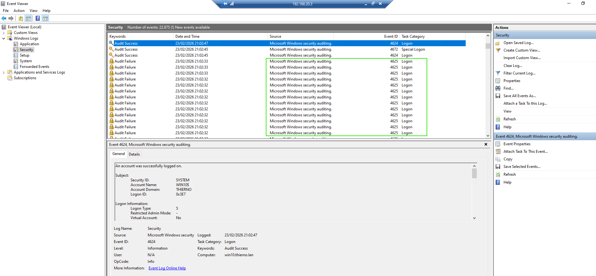
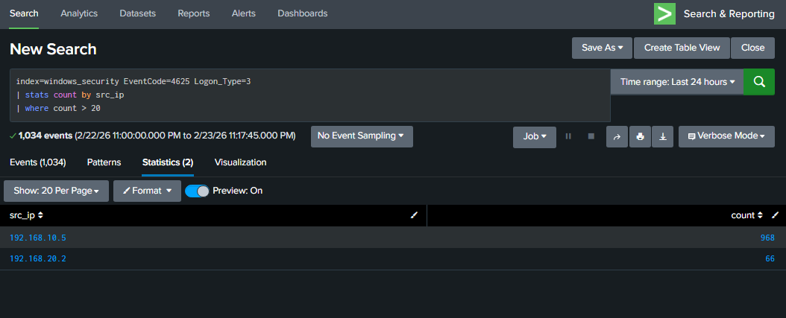
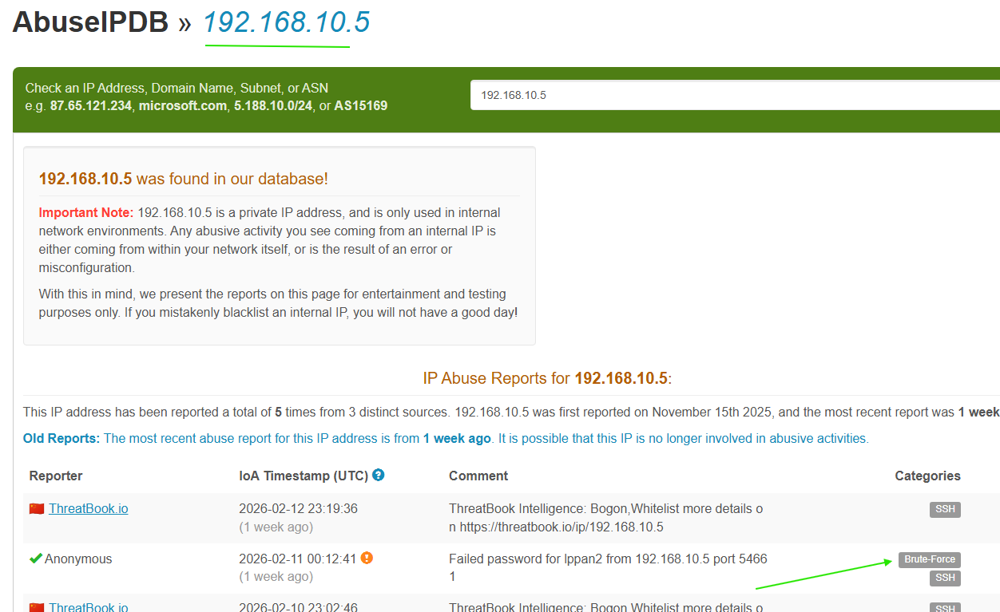
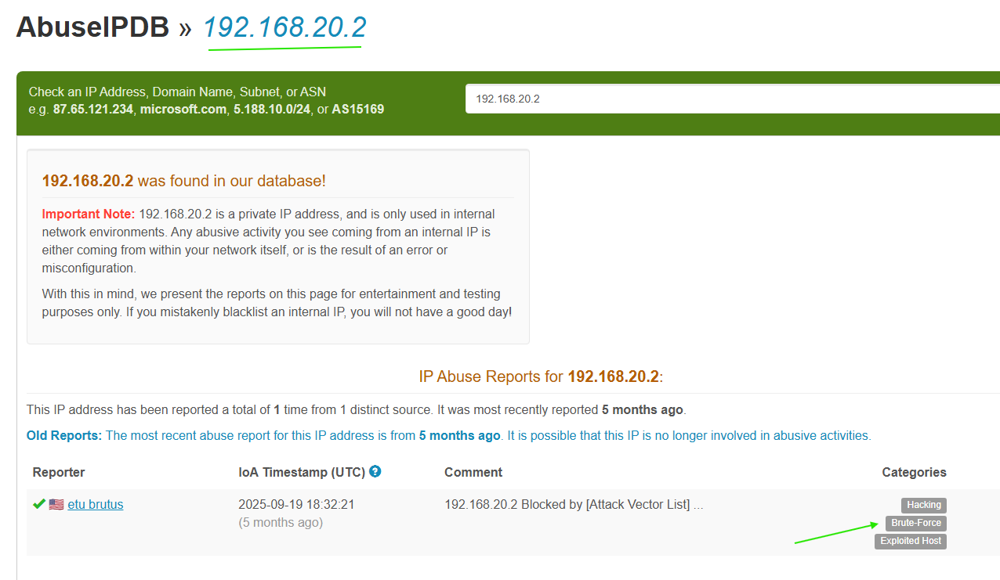

### 4.2 Encoded PowerShell – MITRE T1059

- **Goal**: Detect hidden PowerShell commands.

- **Logic**:
  - Monitor Sysmon Event ID 1
  - Detect `-EncodedCommand` or `-enc`
  - Identify long Base64 strings

- Risk Score: 70

  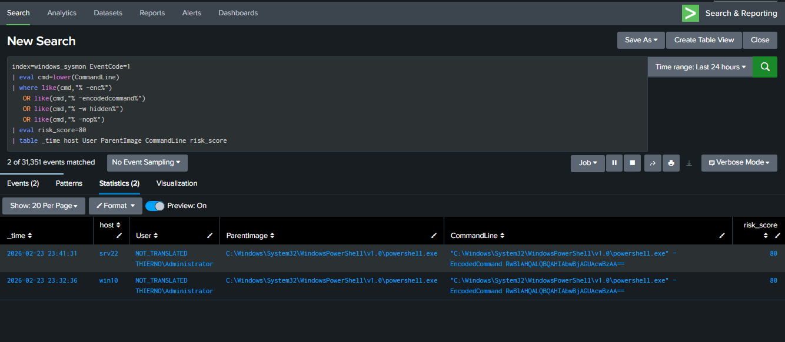

### 4.3 LSASS Credential Dumping – MITRE T1003

- **Goal**: Detect credential dumping attempts.

- **Logic**:
  - Monitor Sysmon Event ID 10
  - Target process: lsass.exe
  - Exclude legitimate processes

- Risk Score: 90

  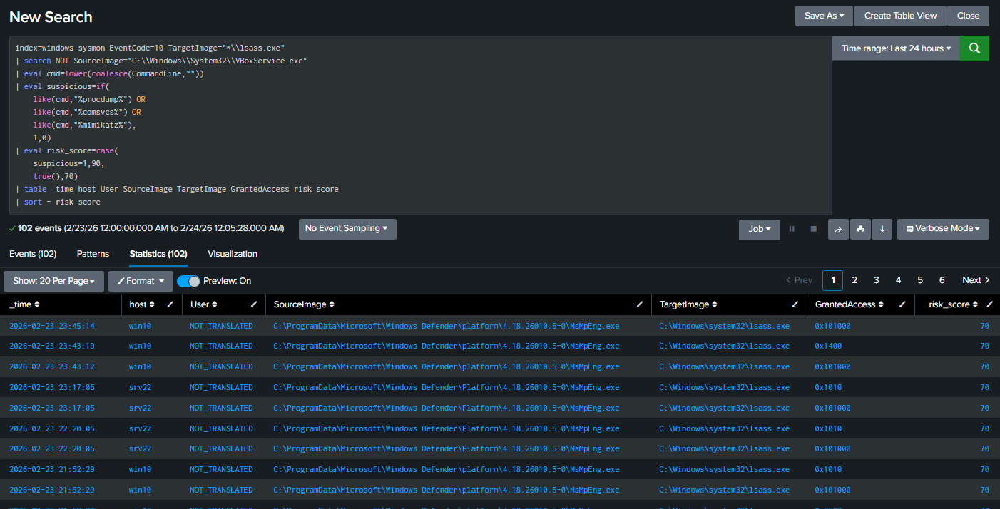

### 4.4 Kerberoasting – MITRE T1558.003

- **Goal**: Detect suspicious Kerberos ticket requests.

- **Logic**:
  - Monitor Event ID 4769
  - Detect RC4 encryption (0x17)
  - Exclude machine accounts

- Risk Score: 80

  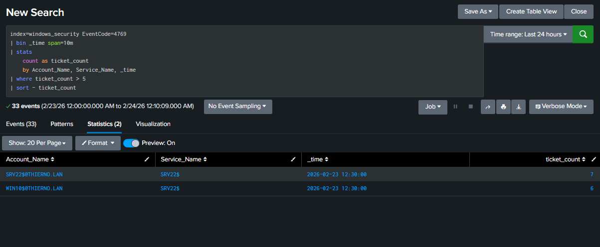

### 4.5 DCSync Attack – MITRE T1003.006

- **Goal**: Detect Active Directory replication abuse.

- **Logic**:
  - Monitor Event ID 4662
  - Detect replication GUIDs
  - Exclude Domain Controllers

- Risk Score: 95

  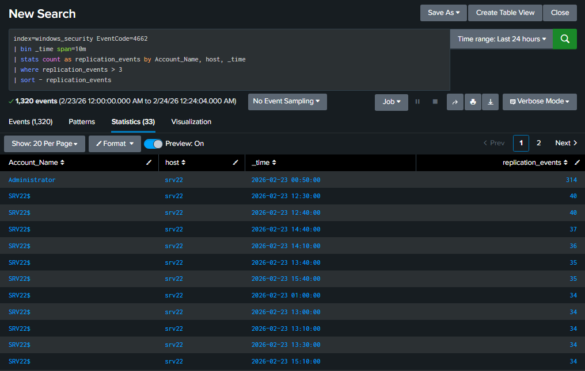

### 4.6 SSH Brute Force – MITRE T1110

- **Goal**: Detect failed SSH logins on Ubuntu.

- **Logic**:
  - Monitor auth.log
  - Count “Failed password”
  - Alert if >10 in 5 minutes

- Risk Score: 50

  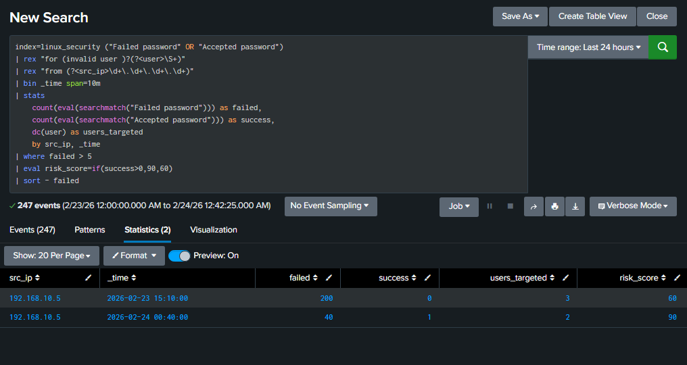

### 4.7 Reverse Shell – MITRE T1059

- **Goal**: Detect suspicious outbound connections.

- **Logic**:
  - Monitor Sysmon Event ID 3
  - Detect cmd.exe or powershell.exe
  - Exclude common ports (80, 443)

- Risk Score: 85

  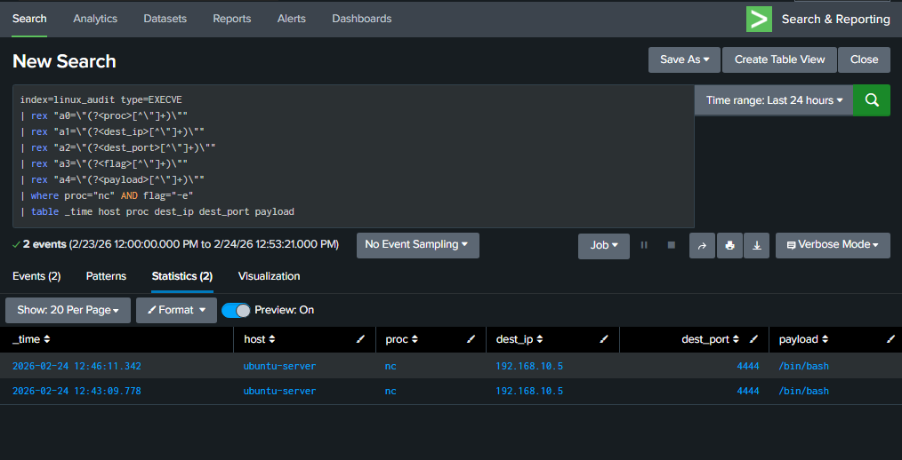

### 4.8 Port Scan – MITRE T1046

- **Goal**: Detect network scanning activity.

- **Logic**:
  - Analyze pfSense logs
  - Count distinct ports per source IP
  - Cross-check with Suricata alerts

- Risk Score: 40

  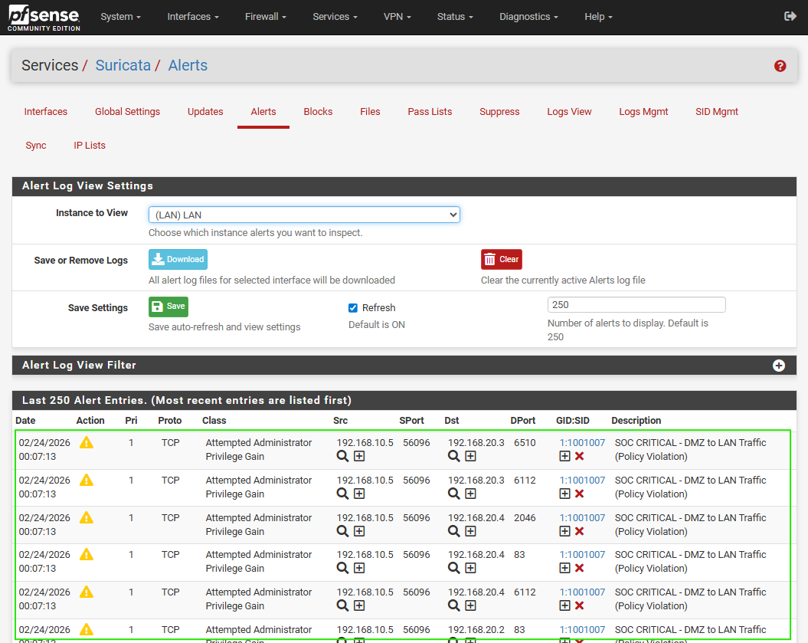

  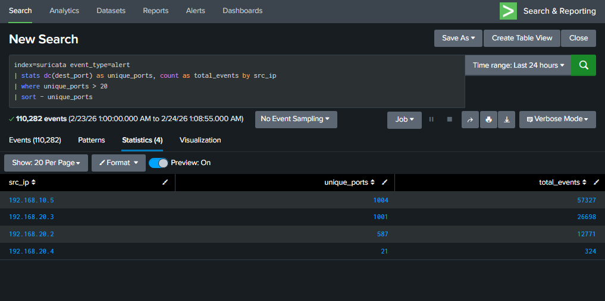

### 4.9 Persistence via Scheduled Task – MITRE T1053

- **Goal**: Detect malware persistence.

- **Logic**:
  - Detect schtasks.exe execution
  - Monitor suspicious command patterns

- Risk Score: 75

  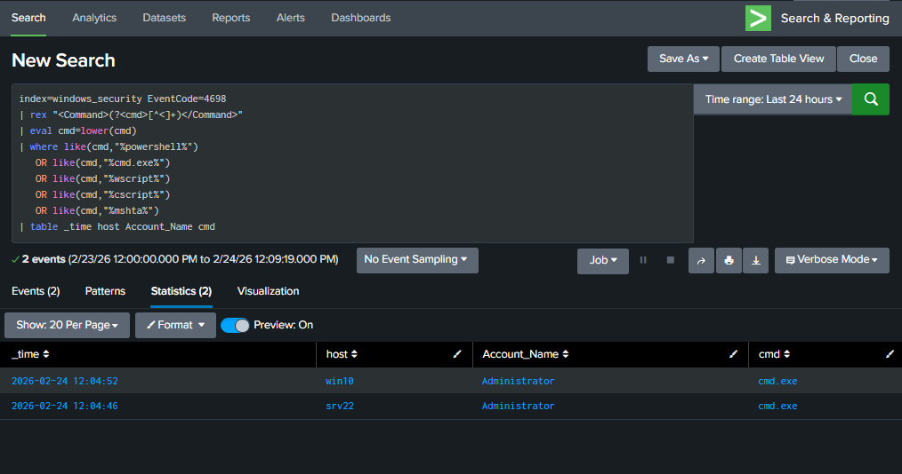

---

## 5. MITRE ATT&CK Coverage Summary

| Tactic            | Techniques Covered |
| ----------------- | ------------------ |
| Initial Access    | T1110              |
| Execution         | T1059              |
| Persistence       | T1053              |
| Credential Access | T1003, T1558       |
| Discovery         | T1046              |

- This ensures structured detection coverage across the attack lifecycle.

---

## 6. Risk-Based Alerting Engine

- Each detection adds a risk score.

- **Risk Factors**
  - Attack severity
  - Asset importance (Domain Controller = high value)
  - Repeated alerts
  - Detection confidence

- **Thresholds**
  - Risk > 150 → SOC Alert
  - Risk > 200 → Automated Response

- This reduces alert fatigue and prioritizes real threats.

  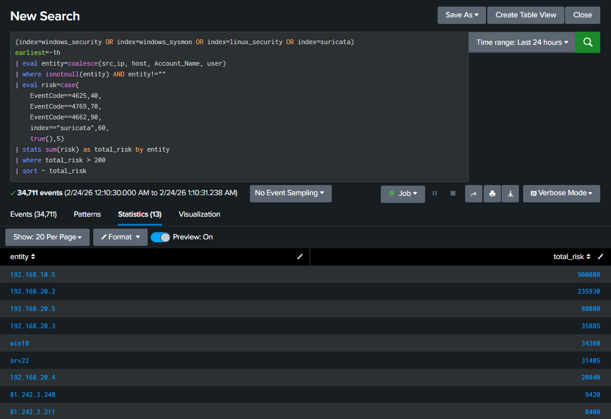

---

## 7. Automated Response

- When risk score exceeds 200:
  - Identify malicious IP
  - Connect to pfSense via SSH
  - Run: `easyrule block DMZ <IP>`

  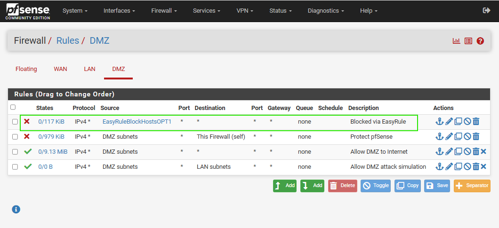
  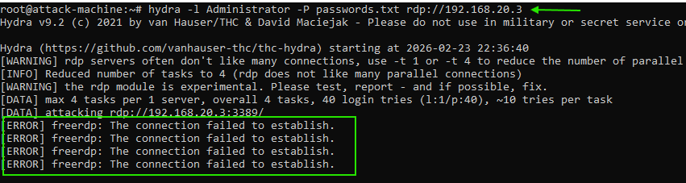
  - Verify firewall rule
  - Create incident ticket
  - Start forensic collection

- This reduces response time to less than 5 minutes.

---

## 8. Detection Tuning & Optimization

- False positives were reduced by approximately 60% by:
  - Excluding machine accounts
  - Whitelisting legitimate LSASS access
  - Adjusting brute force thresholds
  - Filtering authorized admin activity
  - Applying asset-based risk multipliers

---

## 9. Results

- 10 detection use cases implemented
- 10,000+ simulated attack events
- Multi-source log correlation
- Automated containment operational
- Average response time: < 5 minutes
- 60% reduction in false positives

---

## 10. Skills Demonstrated

- SIEM engineering with Splunk Enterprise
- Detection rule development
- MITRE ATT&CK mapping
- Windows & Linux log analysis
- Network monitoring with Suricata
- Firewall automation with pfSense
- Risk-based alerting
- Incident response workflow design
